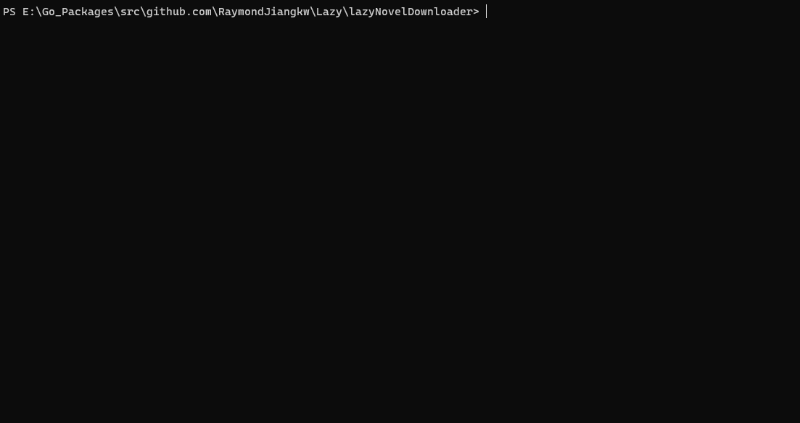

# NovelDownloader


lazyNovelDownloader is a tool for downloading available texts from websites.

## Declaration
>This software does not provide any text by itself. Rights of texts are all reserved for original authors, who have the rights to require users to delete their works.
>Any conflict, dispute and lawsuit resulted from texts are all attributed to users. RaymondJiangkw does not take any responsibility of it.
> 
>Copyright © 2020 RaymondJiangkw. All rights reserved.

## Building
```shell
$ go get -v github.com/RaymondJiangkw/Lazy/lazyNovelDownloader
$ go build lnd.go
```

## Usage
| Command | Description                        | Optional | Default               |
| ------- | ---------------------------------- | -------- | --------------------- |
| name    | Novel Name                         | false    |                       |
| auto    | Whether to detect catalogs automatically, given the name of novel | true | false
| source  | URL for Catalog Html File of Novel | true     | ""                    |
| author  | Novel Author                       | true     | ""                    |
| format  | txt/epub                           | true     | txt                   |
| o       | Output File Name(can include path) | true     | Arg of `name` command |
| h/help  | Log Help                           |          |                       |
* NOTICE: One of `source` and `auto` must be specified. When they are both given, `source` will be used.

## Feature
* Support `.epub` output format.
* Asynchronize I/O operations to prevent `cache` mechanism from influencing performance.
* Realize *Auto-Detection* of catalogs to save labor and *Merging* of catalogs to generate better content.

## Acknowledge
* `Bing`: used to search catalogs of novel.
* `bmaupin/go-epub`: used to generate `.epub` file.
* `mvdan/xurls`: used to delete `url` from text.
* `cheggaaa/pb`: used to generate multiple progress bars.
* `andybalholm/cascadia`: used to extract tags based on CSS Selector.
* `cj1128/myers-diff`: used to integrate catalogs provided by different websites.
* [Ans in Stack Overflow](https://stackoverflow.com/questions/53666867/after-called-peek-method-the-origin-data-has-changed): used to decode html file.

## Issue
* When the width of terminal is too small to fit in the whole progress bar, there will be some display errors.
* When the amount of chapters of novel is too small, `auto` may result in wrongly chosen catalogs.

## Log
* 2020/08/10 Release Beta Version.
* 2020/08/08 Rewrite the whole program and Prepare for Auto-Detection.
* 2020/08/01 Release Alpha Version.